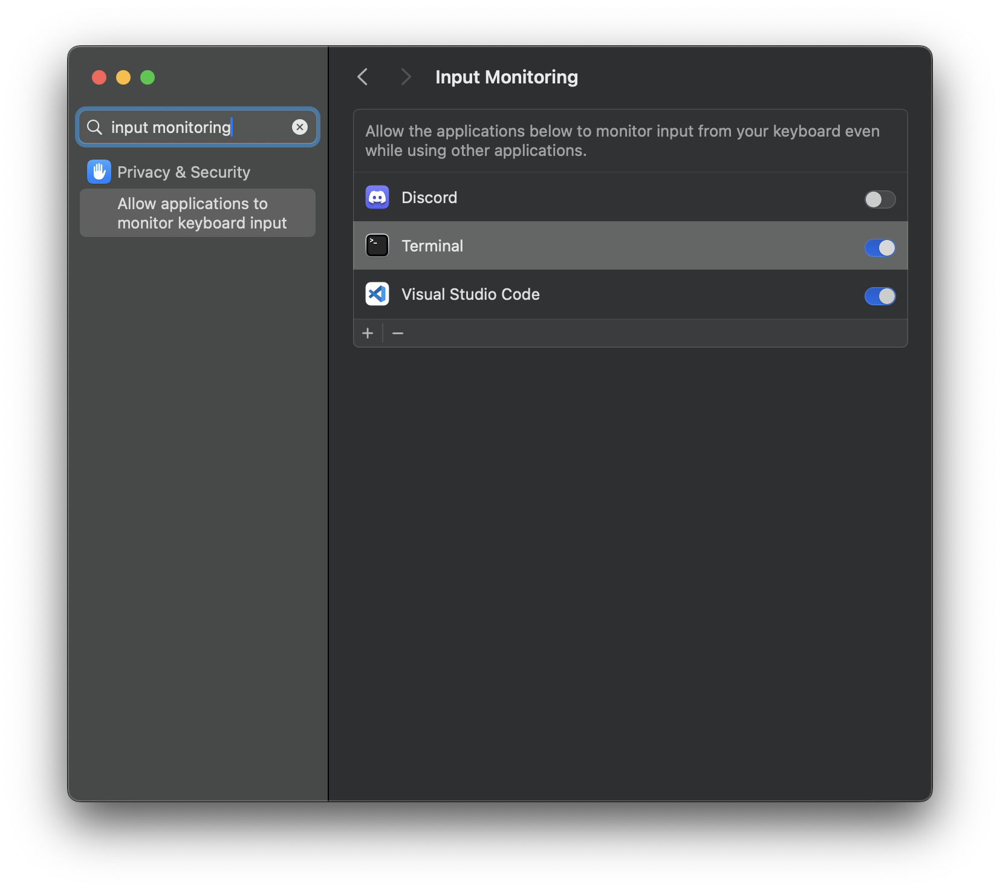
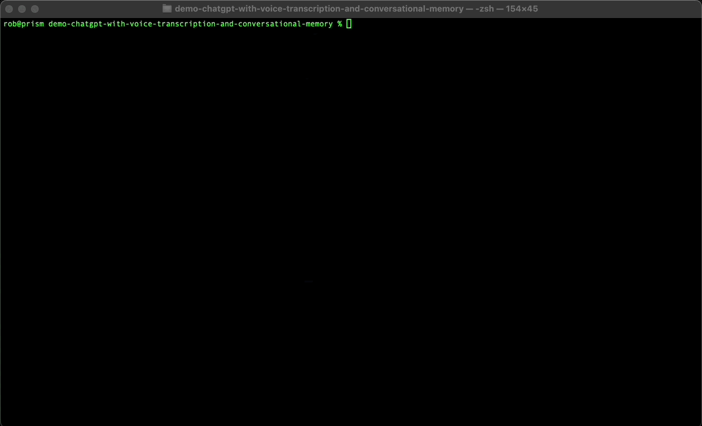
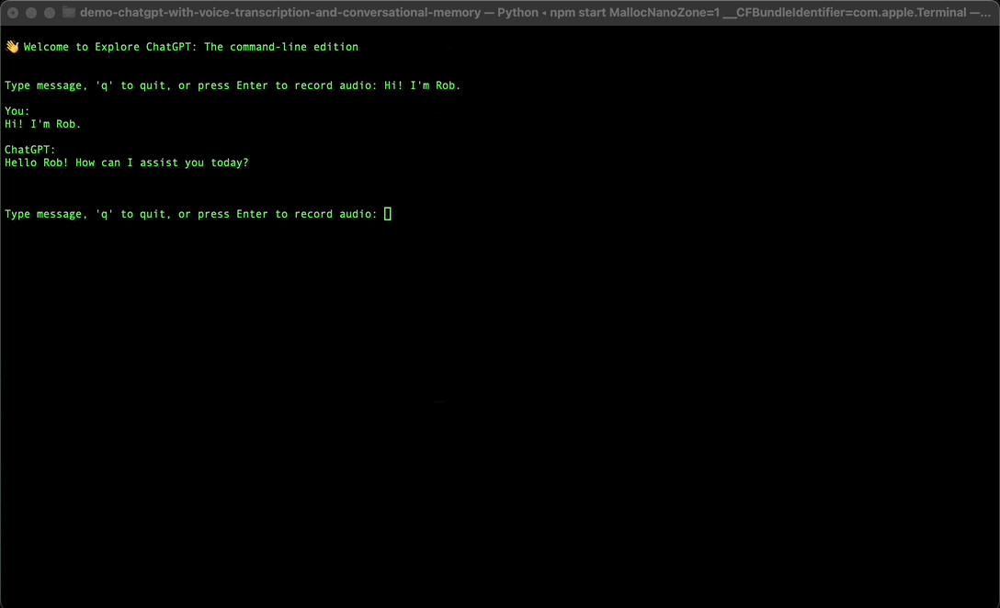
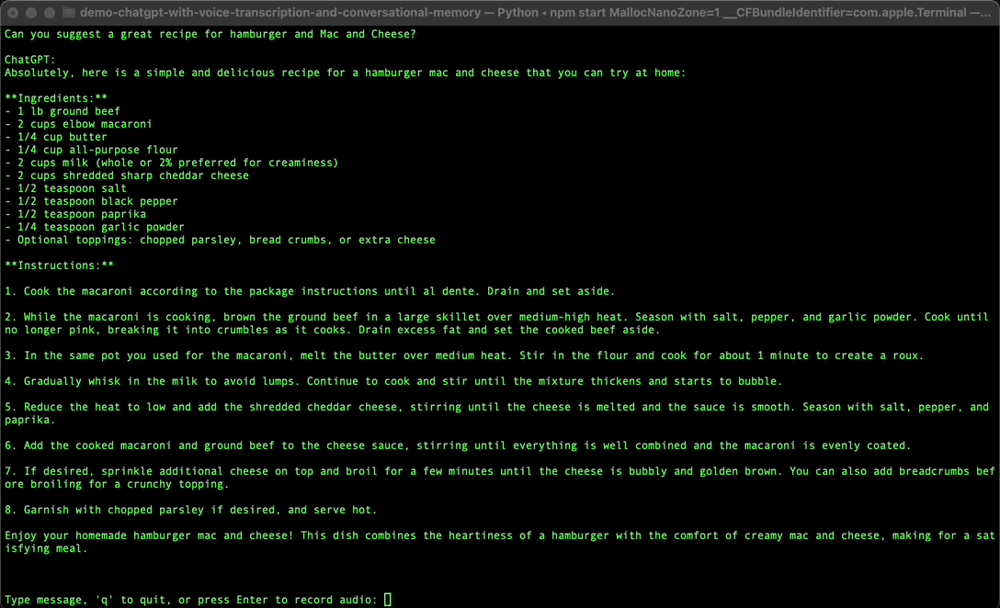
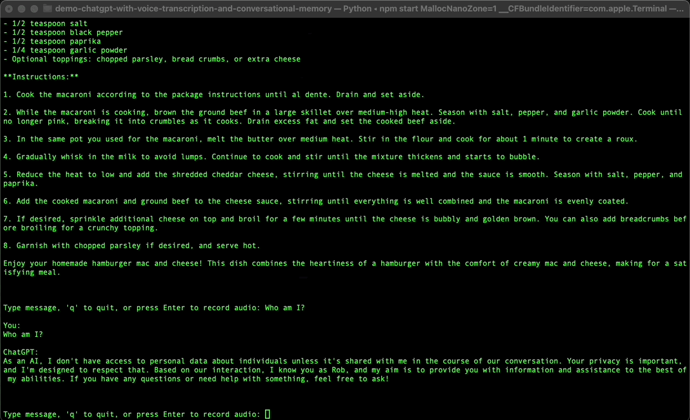
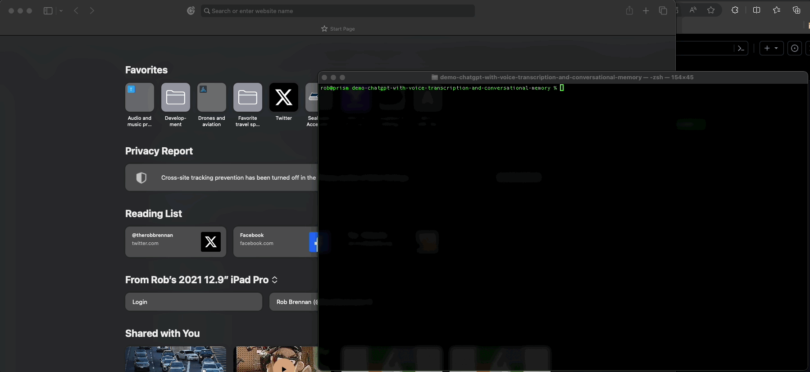

# Welcome

This project was inspired by [How to Build a Personal ChatGPT with the OpenAI API](https://medium.com/@jordan_gibbs/how-to-build-a-personal-chatgpt-with-the-openai-api-2130b48f9586).

## Features

This demo was built to run as a command-line interface (CLI) tool for interacting with ChatGPT using text, voice, and an ability to load additional prompt details or information from `src/data/prompts/gpt_prompt.txt`

All you need to do is create a `src/.env` file with a valid `OPENAI_API_KEY` 🤖

**IMPORTANT:** If you are running this application on macOS, you will likely have to update security settings to allow input monitoring for the Terminal, VS Code, or other applications where you are running this project from the command line.



### Start the application



### Ask your question by speaking into your microphone

This demo will record and save your audio to a local file - using OpenAI Whisper to transcribe the WAV file into a user prompt for ChatGPT to respond to.



### Conversational memory

This demo will allow you to reference recent information in your conversation. For example, you might introduce yourself and then ask ChatGPT who you are later in the conversation.



### A polite thank you when exiting the program



### Tests



## Getting started

Assuming your development environment meets the prerequisites below, all you need to do to get started with this project is:

- Copy `./src/.env.sample` to `./src/.env` and update with your OpenAI API key and other desired environment variables
- Run `npm start` to create the Python virtual environment and install all of the dependencies from `requirements.txt`
  - ALTERNATIVE: If you don't have `node` and `npm` installed on your system, you can run `./manage.sh start` instead
- Run the `deactivate` command when you're ready to leave the Python virtual environment
- Run `npm run destroy` to delete your virtual environment completely
  - ALTERNATIVE: If you don't have `node` and `npm` installed on your system, you can run `./manage.sh destroy` instead

To run tests:

- Run `npm run test` to execute the suite of tests contained within the `tests` folder
  - ALTERNATIVE: If you don't have `node` and `npm` installed on your system, you can run `./manage.sh test` instead
- Run `npm run test:coverage` to execute the suite of tests contained within the `tests` folder
  - ALTERNATIVE: If you don't have `node` and `npm` installed on your system, you can run `./manage.sh test --coverage` instead

### Prerequisites

Please make sure that you have the following installed on your development environment:

- [Node.js](https://nodejs.org/en)
- [Python](https://www.python.org)

This code base was initially developed and tested on:

- 2021 14" MacBook Pro
  - Apple M1 Max
  - 64 GB memory
  - 2 TB SSD
  - macOS Sonoma `14.2.1`
    - Node.js `v20.9.0`
    - npm `10.2.5`
    - Python `3.11.1`

### Scripts

This project includes several scripts to get you up and running with your local development environment using `npm` (e.g., `npm run` setup`):

- `start`

  - This script uses the Python virtual environment at `.venv` to run the application locally

- `test`

  - This script uses the Python virtual environment at `.venv` and runs the unit tests for our application

- `test:coverage`

  - This script uses the Python virtual environment at `.venv`, runs the unit tests for our application, and generates an HTML coverage report at [./htmlcov/index.html](./htmlcov/index.html) that will automatically open in the default web browser on macOS.

- `destroy`
  - This script removes the Python virtual environment at `.venv`

## Python cheat sheet

If you're just getting started with Python, here are snippets of commands that you may find helpful to get you up and running in no time.

```sh
# Verify that you have Python installed on your machine
% python3 --version
Python 3.11.1

# Create a new virtual environment for the project
% python3 -m venv .venv

# Select your new environment by using the Python: Select Interpreter command in VS Code
#   - Enter the path: ./.venv/bin/python

# Activate your virtual environment
% source .venv/bin/activate
(.venv) %

# PREFERRED: Install the packages from requirements.txt
(.venv) % pip install -r requirements.txt

# Install Python packages in a virtual environment
# (.venv) % pip install <package_name>

# Install Python testing packages
# (.venv) % pip install pytest pytest-asyncio
# (.venv) % pip install pytest-cov

# When you are ready to generate a requirements.txt file
# (.venv) % pip freeze > requirements.txt

# Uninstall the package from your virtual environment
# (.venv) % pip uninstall simplejson

# Remove the dependency from requirements.txt if it exists
# (.venv) % pip uninstall -r requirements.txt

# To run unit tests:
# (.venv) % pytest

# To run unit tests and automatically view the HTML coverage report on macOS:
# (.venv) % pytest --cov=. --cov-report=html && open htmlcov/index.html

# To run a single unit test
# (.venv) % pytest test_something.py

# Deactivate your virtual environment
(.venv) % deactivate
% 
```
